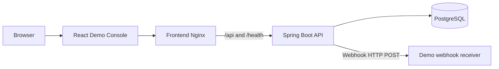
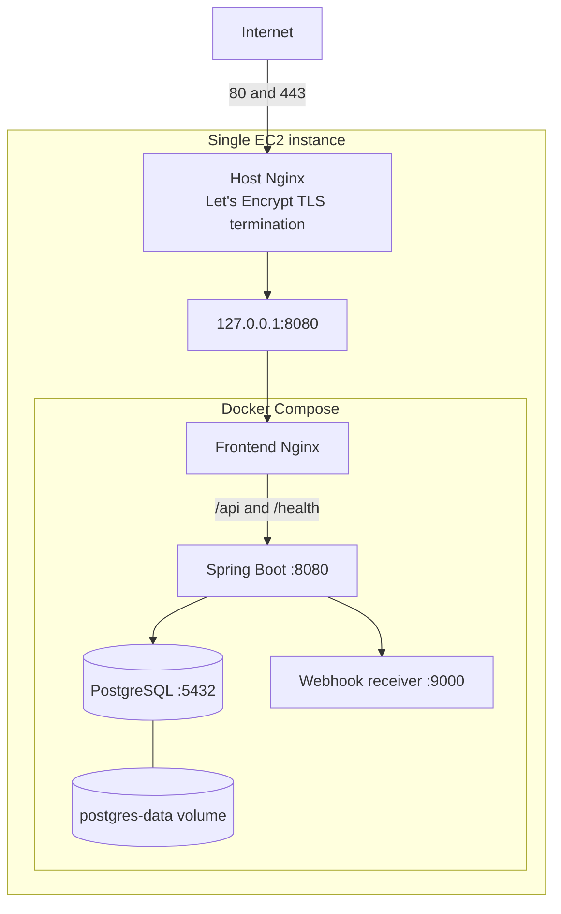
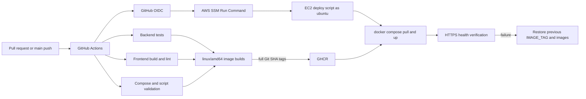

# LedgerPay Architecture

LedgerPay is a sandbox payment lifecycle simulator. Its portfolio focus is the
Spring Boot domain model, PostgreSQL integrity rules, transaction boundaries,
idempotency, refund concurrency, webhook delivery, and production delivery
path. The React application is a deliberately thin demonstration client.

## 1. Application architecture

The browser creates a real Demo Merchant through `POST /api/v1/merchants`,
keeps the one-time API key in `sessionStorage`, and sends ordinary authenticated
API requests. Resetting the demo creates a new Merchant; it does not invent a
frontend-only identity or delete historical backend data.

The frontend displays requests, responses, and lifecycle state, but it does not
own payment rules. Spring Boot remains responsible for:

- deriving Merchant identity from the Bearer API key;
- scoping every Order, Payment, Refund, and WebhookEvent lookup to that Merchant;
- validating allowed state transitions and refund capacity;
- defining transaction boundaries and idempotent replay behaviour;
- persisting the business transition and its WebhookEvent together.

PostgreSQL is an active integrity boundary, not only storage. Composite foreign
keys preserve Merchant ownership across related records. Unique constraints
protect Merchant-scoped idempotency, one pending/succeeded Payment per Order,
and one event of each business type per Payment or Refund. Check constraints
protect status, amount, lifecycle timestamp, and refund-summary invariants.

The demo webhook receiver is an internal test destination. It records visible
evidence that LedgerPay performed a real HTTP delivery; it is not a production
Merchant integration.

## 2. Production architecture

The public URL is `https://ledgerpay.yianz.me`. Host Nginx terminates TLS using
Let's Encrypt certificates and proxies to the Docker frontend on loopback. A
standalone host-Nginx rule limits only `POST /api/v1/merchants` by source IP.

Docker Compose runs four services: frontend, backend, PostgreSQL, and the demo
webhook receiver. Only the frontend publishes a host port, bound to
`127.0.0.1:8080`. Backend, PostgreSQL, and the webhook receiver have no host
port mappings and share an `internal: true` Docker network. This also prevents
the backend from having unrestricted outbound Internet access while still
allowing its configured internal webhook destination.

The PostgreSQL named volume survives normal container recreation. It is not an
off-instance backup. Services use restart policies and health checks; container
logs use bounded local rotation. AWS Security Group rules expose public HTTP
and HTTPS. SSH, if retained for emergency access, is restricted separately to
the owner's IP; normal deployment uses AWS Systems Manager rather than SSH.

## 3. CI/CD architecture

Pull requests run backend tests, frontend build/lint, production Compose
validation, and deployment-script syntax checks. A push to `main` builds the
backend, frontend, and webhook-receiver images for `linux/amd64`, tags each with
the exact Git commit SHA, and publishes them to GHCR.

GitHub Actions uses short-lived OIDC credentials to call AWS SSM. SSM executes
the installed deployment script as `ubuntu`, preserving that user's Docker and
GHCR access. The script atomically changes only `IMAGE_TAG` in the EC2 `.env`,
pulls and starts the three application images, waits for Compose health, and
then verifies `https://ledgerpay.yianz.me/health`.

If health verification fails, the script restores the previous `IMAGE_TAG`,
starts the previous application images, verifies production health, and fails
the workflow. PostgreSQL and its named volume are not removed.

Application-image rollback does **not** reverse Flyway migrations. Future
schema changes must be backward-compatible with the previous application image
or use a staged migration or forward-fix strategy. Normal CD is image-only;
host Nginx, Compose, and operating-system changes are synchronized separately.
