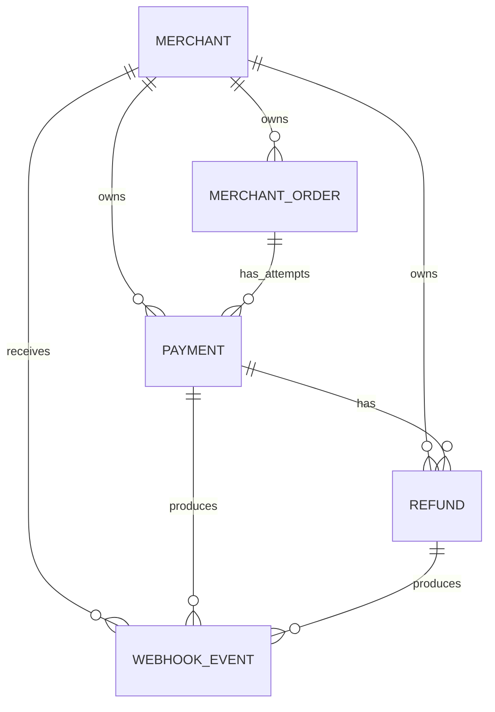

# LedgerPay Database Design

## 1. Purpose

This document defines the first-version database design for LedgerPay, a Spring Boot payment simulator. It covers the five core entities:

- `merchant`
- `merchant_order`
- `payment`
- `refund`
- `webhook_event`

The design prioritises:

- strong data consistency for payment and refund operations;
- clear audit history;
- merchant-scoped idempotency;
- safe concurrent refund handling;
- simple implementation suitable for a first Spring Boot payment project;
- enough structure to resemble a real payment backend without adding unnecessary scope.

API endpoint design is intentionally excluded and will be documented separately.

---

## 2. Technology and Naming Decisions

### 2.1 Database

LedgerPay uses **PostgreSQL**.

PostgreSQL was selected because the design relies on:

- relational integrity and foreign keys;
- database transactions;
- `CHECK` constraints;
- partial unique indexes;
- UUID support;
- `TIMESTAMPTZ` for UTC timestamps;
- `JSONB` for webhook payload snapshots;
- row-level pessimistic locking for refund concurrency control.

### 2.2 Naming conventions

- Table names use singular `snake_case`.
- Database columns use `snake_case`.
- Java entity fields use `camelCase`.
- JPA/Hibernate maps Java fields to database columns.

Examples:

| Java field | Database column |
|---|---|
| `merchantId` | `merchant_id` |
| `merchantOrderId` | `merchant_order_id` |
| `idempotencyKey` | `idempotency_key` |
| `createdAt` | `created_at` |

The order table is named `merchant_order` instead of `order` to avoid conflict with the SQL `ORDER BY` keyword.

### 2.3 Identifier strategy

All primary keys use `UUID`.

UUIDs are generated by Spring Boot/Hibernate before insertion. PostgreSQL enforces uniqueness through primary-key constraints.

### 2.4 Money representation

All monetary amounts use the smallest currency unit and are stored as `BIGINT`.

Example:

```text
EUR 10.99 -> amount = 1099
```

Floating-point types such as `FLOAT` and `DOUBLE` must not be used for money.

### 2.5 Currency

LedgerPay v1 supports only EUR.

```text
currency = 'EUR'
```

Currency columns use `VARCHAR(3)` with Java Enum validation and PostgreSQL `CHECK` constraints.

### 2.6 Time handling

All timestamps are stored in UTC using PostgreSQL `TIMESTAMPTZ`.

Spring Boot should use `Instant` for these values.

- `created_at` is generated automatically by the database.
- `updated_at` is generated on insert and automatically refreshed by a database update trigger.
- API clients must not control audit timestamps.

Migration V2 introduced the reusable PostgreSQL trigger function
`set_updated_at()`. Both `trg_merchant_set_updated_at` and
`trg_merchant_order_set_updated_at` execute this function. The previous
Merchant-specific function `set_merchant_updated_at()` was removed after the
Merchant trigger was switched to the generic helper.

---

## 3. Entity Relationships



Core relationship rules:

```text
Merchant 1 --- 0..N MerchantOrder
MerchantOrder 1 --- 0..N Payment
Payment 1 --- 0..N Refund
Merchant 1 --- 0..N WebhookEvent
```

A `webhook_event` must reference exactly one business object:

- one `payment`, or
- one `refund`.

It must never reference both and must never reference neither.

---

## 4. Table Design

## 4.1 `merchant`

The `merchant` table represents an organisation that integrates with LedgerPay.

| Column | PostgreSQL type | Nullable | Default / constraint |
|---|---|---:|---|
| `id` | `UUID` | No | Primary key; generated by Spring Boot/Hibernate |
| `name` | `VARCHAR(100)` | No | Display name; duplicates allowed |
| `email` | `VARCHAR(254)` | No | Login/identity email; case-insensitive unique |
| `status` | `VARCHAR(30)` | No | Default `ACTIVE` |
| `webhook_url` | `VARCHAR(2048)` | Yes | Must be a valid HTTP or HTTPS URL when present |
| `api_key_hash` | `VARCHAR(64)` | No | Unique SHA-256 hash of the active API key |
| `deactivated_at` | `TIMESTAMPTZ` | Yes | Set when the merchant becomes inactive |
| `created_at` | `TIMESTAMPTZ` | No | Database-generated UTC timestamp |
| `updated_at` | `TIMESTAMPTZ` | No | Database-maintained UTC timestamp |

### Merchant status values

```text
ACTIVE
INACTIVE
```

### Merchant constraints

```text
status = ACTIVE   -> deactivated_at IS NULL
status = INACTIVE -> deactivated_at IS NOT NULL
```

Email is normalised in the Service layer by trimming whitespace and converting it to lowercase. PostgreSQL additionally enforces case-insensitive uniqueness:

```sql
CREATE UNIQUE INDEX ux_merchant_email_lower
ON merchant (LOWER(email));
```

`api_key_hash` is globally unique:

```text
api_key_hash NOT NULL UNIQUE
```

### Merchant API key policy

LedgerPay v1 supports one active secret API key per merchant.

Generation flow:

1. Create a cryptographically secure random API key in Spring Boot using `SecureRandom`.
2. Add a recognisable prefix such as `lp_test_`.
3. Return the plaintext key to the merchant once.
4. Store only the SHA-256 hexadecimal hash in `api_key_hash`.
5. When a new key is generated, replace the existing hash; the old key immediately becomes invalid.

### Merchant deletion policy

Merchant records use soft deletion:

```text
ACTIVE -> INACTIVE
```

LedgerPay does not physically delete merchants or cascade-delete transaction history.

Before deactivation, the Service layer checks that no relevant Payment, Refund, or WebhookEvent remains in an unfinished state. Historical records retain their original statuses.

---

## 4.2 `merchant_order`

The `merchant_order` table represents an order registered with LedgerPay.

| Column | PostgreSQL type | Nullable | Default / constraint |
|---|---|---:|---|
| `id` | `UUID` | No | Primary key; generated by Spring Boot/Hibernate |
| `merchant_id` | `UUID` | No | Foreign key to `merchant.id` |
| `amount` | `BIGINT` | No | Must be greater than 0 |
| `currency` | `VARCHAR(3)` | No | Only `EUR` in v1 |
| `status` | `VARCHAR(30)` | No | Default `CREATED` |
| `cancelled_at` | `TIMESTAMPTZ` | Yes | Set when the order is cancelled |
| `created_at` | `TIMESTAMPTZ` | No | Database-generated UTC timestamp |
| `updated_at` | `TIMESTAMPTZ` | No | Database-maintained UTC timestamp |

### MerchantOrder status values

```text
CREATED
PAYMENT_PENDING
PAID
PARTIALLY_REFUNDED
REFUNDED
CANCELLED
```

### MerchantOrder constraints

```text
amount > 0
currency = 'EUR'

status = CANCELLED  -> cancelled_at IS NOT NULL
status != CANCELLED -> cancelled_at IS NULL
```

Foreign key:

```text
merchant_order.merchant_id
-> merchant.id
-> ON DELETE RESTRICT
```

Composite uniqueness is required for merchant-ownership foreign keys from `payment`:

```text
UNIQUE (id, merchant_id)
```

### MerchantOrder lifecycle

```text
CREATED
  -> PAYMENT_PENDING
  -> PAID
  -> PARTIALLY_REFUNDED
  -> REFUNDED
```

Cancellation paths:

```text
CREATED -> CANCELLED

PAYMENT_PENDING -> CANCELLED
only when there is no currently PENDING Payment
```

A paid or refunded order cannot be directly cancelled. After payment, money must be returned through the Refund flow.

### Order modification rule

`amount` may be modified only when both conditions are true:

1. `status = CREATED`;
2. no Payment has ever been created for the order.

`currency` is immutable in v1 and always remains `EUR`.

Once a Payment exists, changing the order amount would make the transaction
history inconsistent. The merchant must cancel the old order and create a new
one.

### External order reference

LedgerPay v1 does not store a merchant-provided external order reference. The merchant system is responsible for storing LedgerPay's returned order UUID and maintaining the mapping in its own system.

---

## 4.3 `payment`

A `payment` represents one independent payment attempt for an order.

| Column | PostgreSQL type | Nullable | Default / constraint |
|---|---|---:|---|
| `id` | `UUID` | No | Primary key; generated by Spring Boot/Hibernate |
| `merchant_order_id` | `UUID` | No | References `merchant_order.id` |
| `merchant_id` | `UUID` | No | Direct merchant ownership and idempotency scope |
| `amount` | `BIGINT` | No | Must be greater than 0 |
| `currency` | `VARCHAR(3)` | No | Only `EUR` in v1 |
| `status` | `VARCHAR(30)` | No | Default `PENDING` |
| `idempotency_key` | `VARCHAR(100)` | No | Unique within a merchant |
| `refunded_amount` | `BIGINT` | No | Default `0`; successful refunds only |
| `pending_refund_amount` | `BIGINT` | No | Default `0`; accepted pending refunds |
| `failure_code` | `VARCHAR(50)` | Yes | Required when status is `FAILED` |
| `completed_at` | `TIMESTAMPTZ` | Yes | Set when Payment enters a terminal state |
| `created_at` | `TIMESTAMPTZ` | No | Database-generated UTC timestamp |
| `updated_at` | `TIMESTAMPTZ` | No | Database-maintained UTC timestamp |

### Payment status values

```text
PENDING
SUCCEEDED
FAILED
```

### Payment failure codes

```text
PAYMENT_DECLINED
PROCESSING_ERROR
```

### Payment constraints

```text
amount > 0
currency = 'EUR'
refunded_amount >= 0
pending_refund_amount >= 0
refunded_amount + pending_refund_amount <= amount
```

Status consistency:

```text
PENDING
-> failure_code IS NULL
-> completed_at IS NULL

SUCCEEDED
-> failure_code IS NULL
-> completed_at IS NOT NULL

FAILED
-> failure_code IS NOT NULL
-> completed_at IS NOT NULL
```

### Payment ownership constraints

A Payment belongs directly to a merchant and must reference an order owned by the same merchant.

```text
payment(merchant_order_id, merchant_id)
-> merchant_order(id, merchant_id)
```

The design also retains the direct merchant foreign key:

```text
payment.merchant_id
-> merchant.id
-> ON DELETE RESTRICT
```

For downstream Refund ownership validation:

```text
UNIQUE (id, merchant_id)
```

### Payment idempotency

The merchant generates and submits `idempotency_key` when creating a Payment. The
idempotency namespace is scoped to the authenticated Merchant, and the v1 request
identity is `orderId`.

Database constraint:

```text
UNIQUE (merchant_id, idempotency_key)
```

For the same Merchant, reusing a key with the same `orderId` returns the current
representation of the historical Payment. Reusing it with a different `orderId`
returns `IDEMPOTENCY_CONFLICT`. Different Merchants may use the same key.

Historical lookup happens before mutable Order eligibility validation. For the write
path, LedgerPay locks the requested Order and performs a second idempotency lookup
before validating eligibility. This pessimistic lock serializes writes to the same
Order. The unique `(merchant_id, idempotency_key)` constraint remains the final
protection when concurrent requests for different Orders reuse a key. A unique-race
loser reloads and compares the winning Payment only after its failed write transaction
has fully rolled back; if no winner exists, the original integrity error is rethrown.

### Payment amount and currency rules

LedgerPay v1 does not support split payments or instalments.

```text
Payment.amount = MerchantOrder.amount
Payment.currency = MerchantOrder.currency
```

These cross-table rules are validated in the Service layer.

### Payment attempt rules

An order may have multiple Payment records over its lifetime because a failed attempt may be retried.

Example:

```text
Payment #1 = FAILED
Payment #2 = FAILED
Payment #3 = SUCCEEDED
```

A failed Payment must never be overwritten as successful. A new attempt creates a new Payment record.

Allowed state transitions:

```text
PENDING -> SUCCEEDED
PENDING -> FAILED
```

### One active and one successful payment per order

For the same order:

- at most one Payment may be `PENDING`;
- at most one Payment may be `SUCCEEDED`.

PostgreSQL partial unique indexes:

```sql
CREATE UNIQUE INDEX ux_payment_one_pending_per_order
ON payment (merchant_order_id)
WHERE status = 'PENDING';

CREATE UNIQUE INDEX ux_payment_one_succeeded_per_order
ON payment (merchant_order_id)
WHERE status = 'SUCCEEDED';
```

These constraints prevent simultaneous active attempts and duplicate successful payments, including under concurrent requests.

### Payment refund summaries

```text
available_refund_amount
= amount
- refunded_amount
- pending_refund_amount
```

Only successful refunds contribute to `refunded_amount`.

Accepted refunds in `PENDING` status contribute to `pending_refund_amount` and reserve refundable capacity.

`completed_at` is separate from `updated_at` because later Refund operations modify the Payment summary fields and therefore change `updated_at` after the original payment completed.

### Payment index

```sql
CREATE INDEX idx_payment_merchant_order_id
ON payment (merchant_order_id);
```

---

## 4.4 `refund`

A `refund` represents one independent refund request or attempt against a successful Payment.

| Column | PostgreSQL type | Nullable | Default / constraint |
|---|---|---:|---|
| `id` | `UUID` | No | Primary key; generated by Spring Boot/Hibernate |
| `payment_id` | `UUID` | No | References `payment.id` |
| `merchant_id` | `UUID` | No | Direct merchant ownership and idempotency scope |
| `amount` | `BIGINT` | No | Must be greater than 0 |
| `currency` | `VARCHAR(3)` | No | Only `EUR` in v1 |
| `status` | `VARCHAR(30)` | No | Default `PENDING` |
| `reason_code` | `VARCHAR(50)` | No | Merchant's business reason for refunding |
| `failure_code` | `VARCHAR(50)` | Yes | Required when status is `FAILED` |
| `idempotency_key` | `VARCHAR(100)` | No | Unique within a merchant |
| `created_at` | `TIMESTAMPTZ` | No | Database-generated UTC timestamp |
| `updated_at` | `TIMESTAMPTZ` | No | Database-maintained UTC timestamp |

### Refund status values

```text
PENDING
SUCCEEDED
FAILED
```

### Refund reason codes

```text
CUSTOMER_REQUEST
DUPLICATE_CHARGE
PRODUCT_NOT_RECEIVED
OTHER
```

### Refund failure codes

```text
PAYMENT_NOT_REFUNDABLE
INSUFFICIENT_REFUNDABLE_AMOUNT
REFUND_PROCESSING_ERROR
```

Validation failures detected before a Refund is accepted should normally be returned as API errors without creating a Refund record. Therefore, `PAYMENT_NOT_REFUNDABLE` and `INSUFFICIENT_REFUNDABLE_AMOUNT` are expected mainly as request-level error codes unless the invalid condition is discovered after persistence. A persisted failed Refund will most commonly use `REFUND_PROCESSING_ERROR` in v1.

### Refund constraints

```text
amount > 0
currency = 'EUR'
```

Status consistency:

```text
PENDING / SUCCEEDED
-> failure_code IS NULL

FAILED
-> failure_code IS NOT NULL
```

### Refund ownership constraints

A Refund must belong to the same merchant as its Payment.

```text
refund(payment_id, merchant_id)
-> payment(id, merchant_id)
```

The design also retains the direct merchant foreign key:

```text
refund.merchant_id
-> merchant.id
-> ON DELETE RESTRICT
```

For downstream WebhookEvent ownership validation:

```text
UNIQUE (id, merchant_id)
```

### Refund idempotency

The merchant generates and submits `idempotency_key` when creating a Refund.

```text
UNIQUE (merchant_id, idempotency_key)
```

Idempotency is required even though remaining refundable amount is validated. Amount validation prevents over-refunding, while idempotency prevents one merchant request from being executed twice after network retries.

### Refund eligibility rules

The Service layer validates all of the following before creating a Refund:

```text
Payment.status = SUCCEEDED
Refund.currency = Payment.currency
Refund.amount > 0
Refund.amount <= available_refund_amount
```

`PENDING` and `FAILED` Payments cannot be refunded.

If the refundable amount is already zero, LedgerPay rejects the request and does not create a Refund record.

### Multiple pending refunds

The same Payment may have multiple simultaneous `PENDING` Refund records as long as their reserved total does not exceed the Payment amount.

```text
successful refund total
+ pending refund total
<= Payment.amount
```

### Refund state transitions

Allowed transitions:

```text
PENDING -> SUCCEEDED
PENDING -> FAILED
```

A failed Refund is not overwritten as successful. A merchant retry creates a new Refund with a new idempotency key.

For v1, a terminal Refund record is not modified again, so `updated_at` can be used as its completion time. No separate `completed_at` column is included.

### Refund index

```sql
CREATE INDEX idx_refund_payment_id
ON refund (payment_id);
```

---

## 4.5 `webhook_event`

A `webhook_event` represents one business event that LedgerPay must deliver to a merchant.

### Implementation phase

The schema described in this section is the final v1 target, where a WebhookEvent
may relate to either a Payment or a Refund.

The current V4 migration intentionally implements only the Day 13 Payment-event
foundation:

```text
payment_id NOT NULL
no refund_id yet
event types: PAYMENT_SUCCEEDED, PAYMENT_FAILED
```

Later Refund work will add `refund_id`, make `payment_id` nullable where
appropriate, and add the Payment-or-Refund relationship rules, Refund event
types, ownership constraints, and deduplication index described below. V4 is not
the final WebhookEvent schema and must not be changed retroactively for that
later work.

| Column | PostgreSQL type | Nullable | Default / constraint |
|---|---|---:|---|
| `id` | `UUID` | No | Primary key; generated by Spring Boot/Hibernate |
| `merchant_id` | `UUID` | No | Merchant receiving the event |
| `event_type` | `VARCHAR(50)` | No | Fixed event code |
| `payment_id` | `UUID` | Yes | Present for Payment events |
| `refund_id` | `UUID` | Yes | Present for Refund events |
| `payload` | `JSONB` | No | Immutable snapshot of the external webhook `data` object |
| `status` | `VARCHAR(30)` | No | Default `PENDING` |
| `attempt_count` | `INTEGER` | No | Default `0`; must not be negative |
| `last_attempt_at` | `TIMESTAMPTZ` | Yes | Most recent delivery attempt time |
| `delivered_at` | `TIMESTAMPTZ` | Yes | Successful delivery time |
| `last_failure_code` | `VARCHAR(50)` | Yes | Most recent delivery failure code |
| `created_at` | `TIMESTAMPTZ` | No | Database-generated UTC timestamp |
| `updated_at` | `TIMESTAMPTZ` | No | Database-maintained UTC timestamp |

### Webhook status values

```text
PENDING
DELIVERED
FAILED
```

`FAILED` means the configured maximum number of delivery attempts has been exhausted.

### Webhook event types

```text
PAYMENT_SUCCEEDED
PAYMENT_FAILED
REFUND_SUCCEEDED
REFUND_FAILED
```

The external JSON payload may serialise these values as:

```text
payment.succeeded
payment.failed
refund.succeeded
refund.failed
```

### Webhook failure codes

```text
WEBHOOK_URL_NOT_CONFIGURED
CONNECTION_TIMEOUT
HTTP_ERROR
PROCESSING_ERROR
```

### Payload policy

`payload` stores only an immutable snapshot of the external webhook `data`
object created at the time the business event occurs. It does not contain the
complete external webhook envelope.

Event metadata such as the event ID, event type, creation time, and delivery
state is stored in dedicated `webhook_event` columns. A future outbound webhook
envelope is reconstructed from that persisted metadata and the persisted
immutable `payload`.

This ensures that:

- every delivery attempt uses the same event data;
- later changes to Payment or Order data do not change an existing event;
- the original event data remains auditable;
- the external `data` object does not need to be rebuilt from mutable business records.

### Exactly one related business object

Each WebhookEvent must reference exactly one business object:

```text
payment_id IS NOT NULL and refund_id IS NULL
or
payment_id IS NULL and refund_id IS NOT NULL
```

Database `CHECK`:

```sql
CHECK (
    (payment_id IS NOT NULL AND refund_id IS NULL)
    OR
    (payment_id IS NULL AND refund_id IS NOT NULL)
)
```

The Service layer must also ensure that:

```text
PAYMENT_* event types reference payment_id
REFUND_* event types reference refund_id
```

A PostgreSQL `CHECK` constraint may additionally enforce this mapping.

### Webhook ownership constraints

```text
webhook_event(payment_id, merchant_id)
-> payment(id, merchant_id)

webhook_event(refund_id, merchant_id)
-> refund(id, merchant_id)
```

The design also retains:

```text
webhook_event.merchant_id
-> merchant.id
-> ON DELETE RESTRICT
```

### Webhook delivery lifecycle

At creation:

```text
status = PENDING
attempt_count = 0
last_attempt_at = NULL
delivered_at = NULL
last_failure_code = NULL
```

For every delivery attempt:

```text
attempt_count = attempt_count + 1
last_attempt_at = current UTC time
```

On success:

```text
status = DELIVERED
delivered_at = current UTC time
```

On an unsuccessful attempt before the retry limit:

```text
status remains PENDING
last_failure_code = latest failure code
```

After the maximum configured attempts are exhausted:

```text
status = FAILED
last_failure_code must be present
```

If an earlier attempt failed but a later attempt succeeds, LedgerPay may retain `last_failure_code` for diagnostic history.

### Webhook time constraints

```text
status = DELIVERED  -> delivered_at IS NOT NULL
status != DELIVERED -> delivered_at IS NULL

attempt_count = 0 -> last_attempt_at IS NULL
attempt_count > 0 -> last_attempt_at IS NOT NULL

status = FAILED -> last_failure_code IS NOT NULL
```

### Webhook deduplication

The same business object and event type must produce at most one WebhookEvent.

```sql
CREATE UNIQUE INDEX ux_webhook_payment_event
ON webhook_event (payment_id, event_type)
WHERE payment_id IS NOT NULL;

CREATE UNIQUE INDEX ux_webhook_refund_event
ON webhook_event (refund_id, event_type)
WHERE refund_id IS NOT NULL;
```

This prevents duplicate business events from being persisted. It does not guarantee exactly-once network delivery: a merchant may still receive the same event more than once if the merchant processed it but its HTTP response was lost. A production merchant integration should process webhook event IDs idempotently.

### Webhook destination policy

`webhook_event` does not store a destination URL.

For every attempt, LedgerPay reads the merchant's current URL:

```text
webhook_event.merchant_id
-> merchant.webhook_url
```

If `webhook_url` is absent, the attempt fails with:

```text
WEBHOOK_URL_NOT_CONFIGURED
```

Both HTTP and HTTPS URLs are allowed in v1 to support local development. Production systems should require HTTPS.

### Retry configuration

The maximum delivery-attempt count is not stored in each event. It is configured centrally in Spring Boot, for example:

```properties
webhook.max-attempts=3
```

### Webhook indexes

```sql
CREATE INDEX idx_webhook_event_merchant_id
ON webhook_event (merchant_id);

CREATE INDEX idx_webhook_event_status
ON webhook_event (status);
```

A future high-volume version may replace the ordinary status index with a partial index over `PENDING` and `FAILED` records.

### Webhook security scope

Webhook signature generation and verification are out of scope for LedgerPay v1. No `webhook_secret` is stored.

This is acceptable for a learning simulator, but a production payment platform should sign webhook payloads so merchants can verify their origin and integrity.

---

## 5. Cross-Table Business Rules

The following rules are enforced primarily by the Spring Boot Service layer because they require cross-table reads or state-transition logic. PostgreSQL constraints provide additional protection where technically practical.

### 5.1 Creating a Payment

Before creating a Payment:

1. authenticate the merchant from its API key;
2. confirm that the Merchant is `ACTIVE`;
3. perform the merchant-scoped historical idempotency lookup and compare `orderId`;
4. for a new request, begin the bounded write transaction and lock the MerchantOrder;
5. perform the second merchant-scoped idempotency lookup;
6. confirm that the order belongs to the authenticated merchant;
7. confirm that the order is not already paid, refunded, or cancelled;
8. confirm there is no current `PENDING` or `SUCCEEDED` Payment;
9. validate that Payment amount and currency match the order;
10. create and flush the Payment as `PENDING`;
11. update the order to `PAYMENT_PENDING` and commit.

### 5.2 Completing a Payment

On success, within one database transaction:

```text
Payment.status = SUCCEEDED
Payment.completed_at = current time
MerchantOrder.status = PAID
Create PAYMENT_SUCCEEDED WebhookEvent
```

On failure:

```text
Payment.status = FAILED
Payment.failure_code = fixed failure code
Payment.completed_at = current time
MerchantOrder remains PAYMENT_PENDING
Create PAYMENT_FAILED WebhookEvent
```

A failed Payment does not make the order permanently failed. A new Payment may be created after no Payment remains pending.

### 5.3 Creating a Refund

Refund creation requires a database transaction and a pessimistic write lock on the related Payment row.

Conceptual flow:

```text
BEGIN TRANSACTION
-> SELECT Payment FOR UPDATE
-> verify Payment is SUCCEEDED
-> calculate available refundable amount
-> validate Refund amount
-> apply merchant-scoped idempotency
-> create Refund as PENDING
-> increase Payment.pending_refund_amount
COMMIT
```

The lock applies only to the relevant Payment row. Refunds for different Payments may proceed concurrently.

### 5.4 Completing a Refund

On successful Refund, within one transaction:

```text
Refund.status = SUCCEEDED
Payment.pending_refund_amount -= Refund.amount
Payment.refunded_amount += Refund.amount
```

Then update the order:

```text
0 < refunded_amount < payment amount
-> MerchantOrder.status = PARTIALLY_REFUNDED

refunded_amount = payment amount
-> MerchantOrder.status = REFUNDED
```

On failed Refund:

```text
Refund.status = FAILED
Refund.failure_code = fixed failure code
Payment.pending_refund_amount -= Refund.amount
Payment.refunded_amount remains unchanged
```

### 5.5 Creating Webhook events

Webhook creation should be part of the same transaction that commits the related business result where practical.

Examples:

```text
Payment succeeds
-> update Payment
-> update MerchantOrder
-> insert PAYMENT_SUCCEEDED WebhookEvent
-> commit
```

```text
Refund succeeds
-> update Refund
-> update Payment refund totals
-> update MerchantOrder
-> insert REFUND_SUCCEEDED WebhookEvent
-> commit
```

This prevents the business state from being committed without the corresponding notification event being recorded.

---

## 6. Database Constraints Summary

### 6.1 Primary keys

```text
merchant.id
merchant_order.id
payment.id
refund.id
webhook_event.id
```

All are UUID primary keys.

### 6.2 Unique constraints and unique indexes

```text
merchant.api_key_hash
LOWER(merchant.email)
merchant_order(id, merchant_id)
payment(id, merchant_id)
payment(merchant_id, idempotency_key)
refund(id, merchant_id)
refund(merchant_id, idempotency_key)
```

Partial uniqueness:

```text
One PENDING Payment per merchant_order
One SUCCEEDED Payment per merchant_order
One event_type per Payment
One event_type per Refund
```

### 6.3 Foreign-key deletion policy

All foreign keys use:

```text
ON DELETE RESTRICT / NO ACTION
```

LedgerPay must not cascade-delete transaction history.

### 6.4 Enum-like code validation

The database stores code values as `VARCHAR`, not PostgreSQL native ENUM types.

Valid values are enforced by:

- Java Enums;
- Service-layer state-transition checks;
- PostgreSQL `CHECK` constraints.

This applies to:

- all `status` columns;
- `currency`;
- `event_type`;
- `reason_code`;
- `failure_code`;
- `last_failure_code`.

Adding a new valid code requires both a Java change and a database migration. This is intentional because new states and codes may affect business rules and data integrity.

---

## 7. Index Summary

Explicit non-unique indexes in v1:

```text
idx_merchant_order_merchant_id_created_at
    ON merchant_order (merchant_id, created_at DESC)
idx_payment_merchant_order_id
idx_refund_payment_id
idx_webhook_event_merchant_id
idx_webhook_event_status
```

`idx_merchant_order_merchant_id_created_at` supports merchant-scoped Order
listing ordered by newest `created_at` first.

Additional indexes are created implicitly or explicitly by primary keys, unique constraints, case-insensitive email uniqueness, merchant-scoped idempotency, partial Payment uniqueness, composite ownership keys, and WebhookEvent deduplication.

Indexes are intentionally limited to common query and processing paths. Additional indexes should be introduced through database migrations after measuring real query patterns.

---

## 8. Spring Boot Responsibility Boundaries

### Controller layer

- receives HTTP requests;
- validates basic request shape;
- passes authenticated requests to the Service layer;
- returns API responses and error codes.

### Service layer

- contains business rules and state-transition logic;
- validates merchant ownership;
- validates amount and currency consistency;
- applies idempotency behaviour;
- coordinates database transactions;
- acquires pessimistic locks for refunds;
- creates corresponding WebhookEvent records;
- returns clear business errors before database constraints are reached.

### Repository layer

- reads and writes entities;
- provides lock-enabled Payment queries;
- provides existence and idempotency lookups.

### PostgreSQL

- stores the final source of truth;
- enforces primary keys, foreign keys, unique constraints, and `CHECK` constraints;
- prevents invalid concurrent writes;
- automatically manages audit timestamps;
- acts as the final data-integrity safeguard.

---

## 9. Out of Scope for Version 1

The following are intentionally excluded:

- API endpoint and request/response design;
- multiple API keys per merchant;
- separate test and live merchant credentials;
- webhook signatures and `webhook_secret`;
- multiple webhook endpoints per merchant;
- merchant employee/user accounts;
- multiple currencies and exchange-rate conversion;
- authorisation and capture as separate payment stages;
- split payments, instalments, and multi-tender payments;
- a separate WebhookDeliveryAttempt table;
- storing a merchant's external order reference;
- physical deletion of financial records;
- optimistic-lock version fields;
- per-event maximum webhook retry settings.

These may be introduced in later versions when there is a concrete product requirement.

---

## 10. Final Table List

```text
merchant
merchant_order
payment
refund
webhook_event
```

This schema is sufficiently complete for the LedgerPay v1 Spring Boot implementation while keeping the project scope manageable for a first payment coding project.
